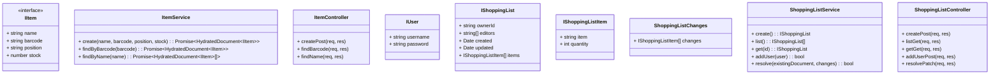

```mermaid
classDiagram

    class IItem {
    + string name
    + string barcode
    + string position
    + number stock
    }
    <<interface>> IItem
    
    class ItemService {
    + create(name, barcode, position, stock) : Promise~HydratedDocument~IItem~~
    + findByBarcode(barcode) : Promise~HydratedDocument~IItem~~
    + findByName(name) : Promise~HydratedDocument~IItem~[]~
    } 
    
    class ItemController {
    + createPost(req, res)
    + findBarcode(req, res)
    + findName(req, res)
    }
    
    class IUser {
    + string username
    + string password
    } 
    
    class IShoppingList {
    + string ownerId
    + string[] editors
    + Date created
    + Date updated
    + IShoppingListItem[] items
    }
    
    class IShoppingListItem { 
    + string item
    + int quantity
    }
    
    class ShoppingListChanges {
    + IShoppingListItem[] changes
    }
    
    class ShoppingListService {
    + create(): IShoppingList
    + list(): IShoppingList[]
    + get(id): IShoppingList
    + addUser(user): bool
    + resolve(existingDocument, changes): bool
    }
    
    class ShoppingListController {
    + createPost(req, res)
    + listGet(req, res)
    + getGet(req, res)
    + addUserPost(req, res)
    + resolvePatch(req, res)
    }
```