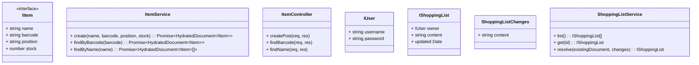

```mermaid
classDiagram

    class IItem {
    + string name
    + string barcode
    + string position
    + number stock
    }
    <<interface>> IItem
    
    class ItemService {
    + create(name, barcode, position, stock) : Promise~HydratedDocument~IItem~~
    + findByBarcode(barcode) : Promise~HydratedDocument~IItem~~
    + findByName(name) : Promise~HydratedDocument~IItem~[]~
    } 
    
    class ItemController {
    + createPost(req, res)
    + findBarcode(req, res)
    + findName(req, res)
    }
    
    class IUser {
    + string username
    + string password
    } 
    
    class IShoppingList {
    + IUser owner
    + string content
    + updated Date
    }
    
    class ShoppingListChanges {
    + string content
    }
    
    class ShoppingListService {
    + list(): IShoppingList[]
    + get(id): IShoppingList
    + resolve(existingDocument, changes): IShoppingList
    }
```